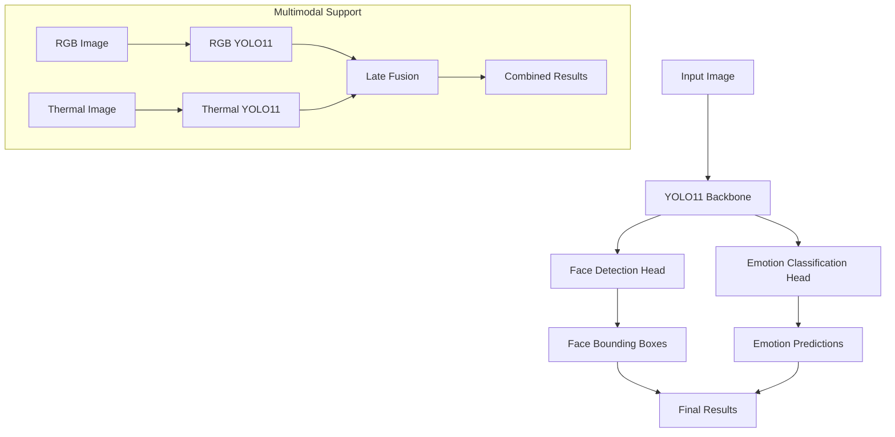

# YOLO11 Facial Emotion Detection


<p align="center">
  
  
  
  
</p>

## Table of Contents
- [Overview](#overview)
- [Features](#features)
- [Architecture](#architecture)
- [Dataset Format & Conversion](#dataset-format--conversion)
- [Installation](#installation)
- [Quick Start](#quick-start)
- [Evaluation](#evaluation)
- [Project Structure](#project-structure)
- [Authors](#authors)

## Overview

This project implements a **real YOLO11-based facial emotion detection system** that can detects faces and then classify emotions. It supports signle modalities (RGB only, Themal only) and multiple modalities (Early Fusion, Late Fusion). Unlike traditional emotion classification approaches that assume pre-cropped face images, this implementation works on **uncropped images** and can detect multiple faces simultaneously, making it suitable for real-world applications.


## Features

- **Real YOLO11 Implementation**: Uses actual Ultralytics YOLO11 (not a custom implementation)
- **Face Detection + Emotion Classification**: End-to-end pipeline in a single model
- **Multi-face Support**: Detect and classify emotions for multiple faces in one image
- **Real-time Performance**: Optimized for speed with 20-50 FPS inference capability

### 🔄 **Multimodal Support**
- **RGB-only Mode**: Standard visible light images
- **Thermal-only Mode**: Infrared thermal images  
- **Early Fusion**: RGB + Thermal combined at input level
- **Late Fusion**: Separate RGB and Thermal models with result fusion

### 📊 **Advanced Features**
- **Automatic Dataset Conversion**: Converts emotion classification datasets to YOLO format
- **MediaPipe Face Detection**: Used for generating bounding box annotations
- **Comprehensive Evaluation**: Confusion matrices, per-class metrics, visualizations
- **Training Visualizations**: Loss curves, accuracy plots, training history
- **Class Imbalance Handling**: Automatic dataset balancing and stratified splits

## Architecture




## Dataset Format & Conversion

### Original Dataset Structure (Input)

The dataset should be organized as follows:

```
dataset/
├── RGB/
│   ├── R_Angry_001_KTFE.jpg
│   ├── R_Happy_001_KTFE.jpg
│   ├── R_Sad_002_KTFE.jpg
│   └── ...
├── Thermal/  (or other names like 'thermal', 'IR', 'infrared')
│   ├── T_Angry_001_KTFE.jpg
│   ├── T_Happy_001_KTFE.jpg
│   └── ...
├── RgbAug/  (Augmented RGB data)
│   ├── aug_R_Angry_001_KTFE.jpg
│   └── ...
└── ThermalAug/  (Augmented thermal data)
    ├── aug_T_Angry_001_KTFE.jpg
    └── ...
```

**File Naming Convention**: `{modality}_{emotion}_{id}_{suffix}.jpg`
- `modality`: R (RGB), T (Thermal), or aug_ prefix for augmented
- `emotion`: Angry, Happy, Sad, Surprised, Fearful, Disgusted, Neutral
- `id`: Unique identifier (e.g., 001, 002)
- `suffix`: Additional identifier (e.g., KTFE, front, side)

### YOLO Dataset Structure (Output)

After conversion, the dataset is transformed into YOLO object detection format:

```
yolo_emotion_dataset/
├── train/
│   ├── images/
│   │   ├── r_angry_001_ktfe.jpg
│   │   ├── r_happy_001_ktfe.jpg
│   │   └── ...
│   └── labels/
│       ├── r_angry_001_ktfe.txt     # "0 0.5 0.5 0.8 0.8" (class x y w h)
│       ├── r_happy_001_ktfe.txt     # "3 0.5 0.5 0.8 0.8"
│       └── ...
├── val/
│   ├── images/
│   └── labels/
├── test/
│   ├── images/
│   └── labels/
└── data.yaml  # YOLO configuration file
```

### Dataset Conversion Process

The conversion process involves several key steps:

1. **Face Detection**: Uses MediaPipe to detect face bounding boxes in each image
2. **Annotation Generation**: Creates YOLO format annotations (class_id, x_center, y_center, width, height)
3. **File Organization**: Splits data into train/val/test sets with stratification
4. **Label Mapping**: Maps emotion names to class indices (0-6)
5. **Quality Control**: Validates images and skips corrupted files

#### YOLO Annotation Format

Each `.txt` file contains one line per detected face:
```
class_id x_center y_center width height
```

Where:
- `class_id`: Emotion class (0=angry, 1=disgusted, 2=fearful, 3=happy, 4=neutral, 5=sad, 6=surprised)
- `x_center, y_center`: Face center coordinates (normalized 0-1)
- `width, height`: Face dimensions (normalized 0-1)

Example annotation file `r_happy_001_ktfe.txt`:
```
3 0.512 0.478 0.234 0.312
```
This represents a "happy" face (class 3) centered at (51.2%, 47.8%) with size 23.4% × 31.2% of the image.

#### Data Splits

| Split | Percentage | Purpose |
|-------|------------|---------|
| **Train** | 64% | Model training (80% of train split) |
| **Validation** | 16% | Hyperparameter tuning (20% of train split) |
| **Test** | 20% | Final evaluation |

## Installation

### Prerequisites
- Python 3.8+
- CUDA-compatible GPU (recommended)


### Setup Environment

```bash
# Create virtual environment
python -m venv venv
source venv/bin/activate  # On Windows: venv\Scripts\activate

# Install dependencies
pip install -r requirements_yolo11.txt
```

### Required Dependencies

The project uses the following key dependencies:

```txt
ultralytics>=8.0.0          # YOLO11 implementation
mediapipe>=0.10.0           # Face detection for dataset conversion
torch>=2.0.0                # Deep learning framework
torchvision>=0.15.0         # Computer vision utilities
opencv-python>=4.8.0        # Image processing
scikit-learn>=1.3.0         # Machine learning metrics
matplotlib>=3.7.0           # Visualization
seaborn>=0.12.0             # Statistical plots
PyYAML>=6.0                 # Configuration files
```

## Quick Start


### 1. Convert Dataset to YOLO Format

```bash
# Convert RGB-only dataset
python main_yolo11.py --convert --modality rgb_only --output-dir yolo_rgb_dataset

# Convert thermal-only dataset
python main_yolo11.py --convert --modality thermal_only --output-dir yolo_thermal_dataset

# Convert for early fusion (RGB + Thermal combined)
python main_yolo11.py --convert --modality early_fusion --output-dir yolo_early_fusion_dataset
```

### 2. Train YOLO11 Model

```bash
# Train RGB-only model
python main_yolo11.py --train --modality rgb_only --epochs 30 --batch-size 16 --data yolo_rgb_dataset/data.yaml
```

### 3. Run Inference

```bash
# Single image inference
python main_yolo11.py --inference --model runs/detect/train/weights/best.pt --input test_image.jpg

# Batch inference on directory
python main_yolo11.py --inference --model best.pt --input test_images/ --conf 0.5
```


## Evaluation

### Model Evaluation

```bash
python main_yolo11.py --evaluate \
  --model runs/detect/train/weights/best.pt \
  --test-data yolo_rgb_dataset/test \
  --conf 0.25
```

### Evaluation Metrics

The evaluation generates comprehensive metrics:

- **Detection Metrics**: Precision, Recall, mAP@0.5, mAP@0.5:0.95
- **Classification Metrics**: Per-class accuracy, F1-scores, confusion matrix
- **Speed Metrics**: Inference time, FPS, preprocessing time

### Visualization Outputs

1. **Training History**: Loss curves, accuracy plots, metric evolution
2. **Confusion Matrix**: Per-class prediction accuracy
3. **Per-Class Metrics**: Precision, recall, F1-score for each emotion
4. **Misclassified Samples**: Examples of incorrect predictions
5. **Detection Examples**: Sample images with bounding boxes and predictions


## Project Structure

```
yolo11-emotion-detection/
├── config.py                 # Configuration classes and enums
├── main_yolo11.py            # Main CLI interface
├── yolo11_emotion_model.py   # YOLO11 model implementation
├── yolo11_trainer.py         # Training pipeline
├── yolo11_evaluate.py        # Evaluation utilities
├── yolo_dataset_converter.py # Dataset conversion utilities
├── utils.py                  # Utility functions
├── dataset.py                # Dataset loading (if needed)
├── requirements_yolo11.txt   # Python dependencies
├── README_YOLO11.md         # This file
├── yolo11n.pt               # Pre-trained YOLO11 model
├── outputs/                  # Training outputs
│   ├── visualizations/       # Training plots and charts
│   ├── results/             # Evaluation results
│   └── checkpoints/         # Model checkpoints
├── models/                   # Saved models
├── logs/                     # Training logs
└── runs/                     # YOLO training runs (auto-generated)
    └── detect/
        └── train/
            └── weights/
                ├── best.pt   # Best model weights
                └── last.pt   # Latest model weights
```

# Authors
- Fiorella Scarpino (21010043)
- May Sanejo (15006280)
- Soumia Kouadri (24058628)